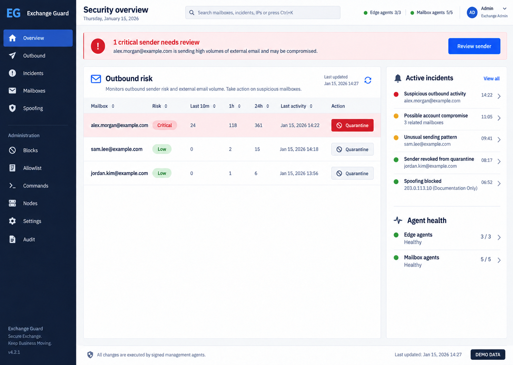
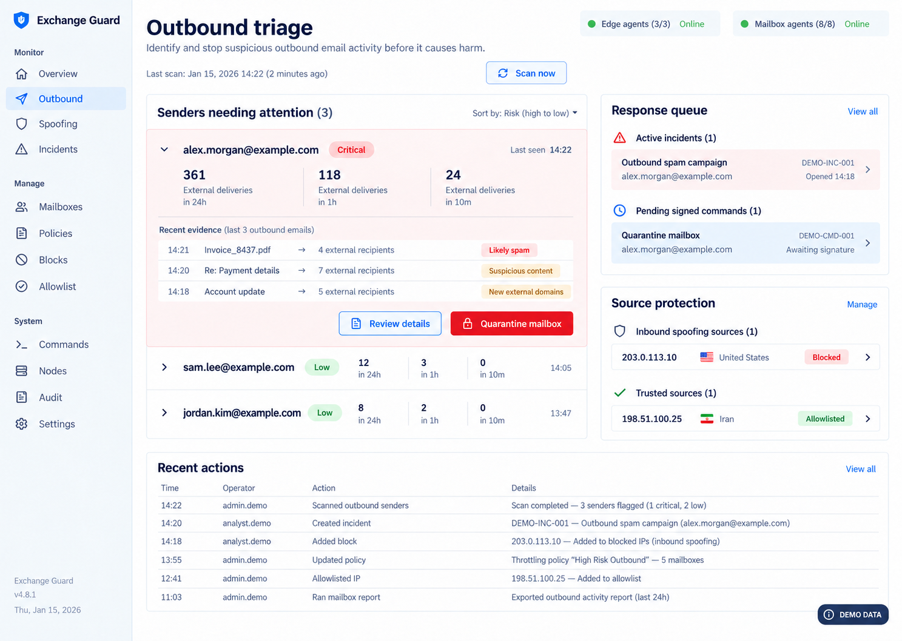

# Exchange Guard Control

Exchange Guard Control is a self-hosted security control plane for on-premises Microsoft Exchange. It combines a web dashboard, signed Windows agents, mailbox throttling management, outbound-volume monitoring, inbound own-domain spoof detection, Edge allow/block controls, audit history, and optional Telegram response actions.

> This is a community project and is not affiliated with or supported by Microsoft. Test every enforcement action in a lab or maintenance window before production use.

## Preview

All values shown below are fictional demo data. No production mailbox, domain, IP address or incident identifier is included.

### Security overview



### Outbound triage



## What it provides

- FastAPI/Jinja web interface with PostgreSQL operational storage.
- HMAC-signed pull agents; the Linux server does not open WinRM or SSH sessions to Exchange.
- Fixed, allowlisted command types only. Arbitrary PowerShell is not accepted.
- Edge IP/domain block management and central allowlists.
- Mailbox inventory, per-mailbox throttling-policy assignment and Regular policy management.
- Controlled mailbox quarantine: disable EWS, add to a block group and purge matching Edge queue items.
- Strict outbound classification using final Edge `SENDEXTERNAL` + `Originating` events, an organization sender and an external recipient.
- Inbound own-domain spoof discovery from public IPs, with accepted and failed attempts separated.
- Optional GeoIP enrichment, country policy, reputation providers and Telegram alerts.
- Full command and operator audit trail.

## Architecture

```text
Administrators -> HTTPS reverse proxy -> Web container -> PostgreSQL
                                            |
                                            +-> optional message-tracking MySQL

Exchange Edge agent -------- signed HTTPS pull/push --------^
Exchange mailbox agent ----- signed HTTPS pull/push --------^
```

The Edge agent can run standalone for manual IP/domain control. Candidate ingestion and remote analyzer-threshold controls require a compatible adaptive analyzer that writes the configured JSONL event file.

## Safe defaults

- The web port binds to loopback by default.
- Message-tracking monitors are disabled until a data source is configured.
- Automatic country blocking is disabled until explicitly enabled.
- Remote switching to analyzer Enforce mode is disabled in the Edge agent.
- Private, loopback, multicast and reserved IP blocks are rejected.
- No real domain, address, host name, IP address, credential or infrastructure data is included.

## Quick start

```bash
git clone https://github.com/hamidsha/exchange-guard-control.git
cd exchange-guard-control
./scripts/generate-env.sh
```

Edit `.env` and replace at least:

```dotenv
TRUSTED_HOSTS=exchange-guard.example.internal
ORGANIZATION_DOMAINS=example.com,example.net
BLOCKED_OUTBOUND_GROUP=Blocked-Outbound-Senders@example.com
```

Start the base control plane:

```bash
docker compose config
docker compose build
docker compose up -d
curl -fsS http://127.0.0.1:8787/healthz
```

Read [Installation](docs/INSTALL.md) before installing either Exchange agent.

## Data sources

| Data | Source | Required for |
|---|---|---|
| Node heartbeat, Edge snapshot, block results | Edge agent | Edge control and node health |
| Mailboxes and throttling policies | Mailbox agent | Mailbox policy management and quarantine |
| `GetMessageTrackingLog` table | External or bundled optional MySQL | Outbound, spoofing and traffic-based reputation |
| JSONL adaptive-analyzer events | Optional external analyzer | Candidate workflow and threshold controls |
| Attachment metadata | Optional custom collector | Attachment tab; otherwise correctly shown as `Not collected` |

See [Data ingestion](docs/DATA-INGESTION.md) for the exact schema and event semantics.

## Documentation

- [Installation](docs/INSTALL.md)
- [Configuration reference](docs/CONFIGURATION.md)
- [Exchange RBAC and mailbox agent](docs/EXCHANGE-RBAC.md)
- [Data ingestion](docs/DATA-INGESTION.md)
- [Optional attachment metadata](docs/ATTACHMENTS.md)
- [Telegram and proxy](docs/TELEGRAM.md)
- [Operations, backup and rollback](docs/OPERATIONS.md)
- [Security model](SECURITY.md)
- [Public release checklist](PUBLICATION-CHECKLIST.md)
- [راهنمای فارسی](README.fa.md)

## Known limitations

- The project does not scrape mailbox contents or store message bodies.
- Exchange message-tracking logs do not contain attachment names. Attachment rows remain `Not collected` unless a separate authorized metadata collector posts them; a signed metadata-only import helper is included.
- A message-tracking collector is environment-specific and is not bundled. A compatible MySQL schema and field mapping are included.
- GeoIP is approximate. Never enable automatic country blocking before allowlisting legitimate relays, websites and shared providers.
- `RecipientRateLimit` is an Exchange throttling value, not a complete account-takeover defense.

## License

[MIT](LICENSE). See also [third-party notices](THIRD_PARTY_NOTICES.md).
